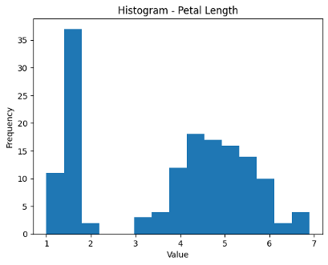
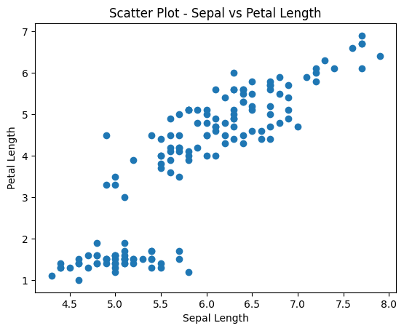

<div align="center">

# DATA MINING AND ANALYSIS

## Iris Dataset Analysis and Visualization

---

**Submitted By:**  
**Girijesh S**  
**Registration Number: RA2311026020008**

**Submitted To:**  
**SRM INSTITUTE OF SCIENCE AND TECHNOLOGY, RAMAPURAM**

---

**Date of Submission:** January 18, 2026

</div>

---

## Table of Contents
1. [Project Overview](#project-overview)
2. [Dataset Source](#dataset-source)
3. [Importing Required Libraries](#1-importing-required-libraries)
4. [Mounting Google Drive](#2-mounting-google-drive)
5. [Loading the Dataset](#3-loading-the-dataset)
6. [Data Preprocessing](#4-data-preprocessing)
7. [Data Visualization](#5-data-visualization)
8. [Conclusion](#conclusion)

---

## Project Overview
This project performs exploratory data analysis on the famous Iris dataset using various visualization techniques. The analysis includes statistical summaries and multiple chart types to understand the relationships between different flower measurements across three species of Iris flowers (Setosa, Versicolor, and Virginica).

## Dataset Source
**Dataset:** Iris Dataset  
**Source:** [Kaggle - UCI Machine Learning Repository](https://www.kaggle.com/datasets/uciml/iris?resource=download)  
**Description:** The dataset contains 150 samples with 4 features (sepal length, sepal width, petal length, petal width) measured in centimeters.

---

## 1. Importing Required Libraries

The following libraries are essential for data manipulation and visualization:
- **pandas**: For data handling and analysis
- **matplotlib.pyplot**: For creating various types of plots and charts

```python
import pandas as pd
import matplotlib.pyplot as plt
```

---

## 2. Mounting Google Drive

Connecting to Google Drive to access the Iris dataset stored in the cloud storage.

```python
from google.colab import drive
drive.mount('/content/drive')
```

---

## 3. Loading the Dataset

Reading the Iris dataset from CSV file into a pandas DataFrame for analysis.

```python
df = pd.read_csv("/content/drive/MyDrive/Iris.csv")
```

---

## 4. Data Preprocessing

Preparing the data by removing non-numeric columns (Id and Species) to focus on numerical features:
- Sepal Length
- Sepal Width
- Petal Length
- Petal Width

```python
num = df.drop(["Id", "Species"], axis=1)
```

---

## 5. Data Visualization

This section presents multiple visualization techniques to analyze and understand the Iris dataset comprehensively.

### 5.1 Bar Chart
Displays the **mean values** of all iris features, providing a quick comparison of average measurements.

```python
# 1. Bar Chart
plt.figure()
num.mean().plot(kind="bar")
plt.title("Bar Chart - Mean of Iris Features")
plt.xlabel("Features")
plt.ylabel("Mean Value")
plt.show()
```

**Output:** A bar chart displaying the mean values of SepalLengthCm, SepalWidthCm, PetalLengthCm, and PetalWidthCm.


---

### 5.2 Line Chart
Shows the **progression of Sepal Length** values across the dataset, useful for identifying trends and patterns.

```python
# 2. Line Chart
plt.figure()
plt.plot(num["SepalLengthCm"])
plt.title("Line Chart - Sepal Length")
plt.xlabel("Index")
plt.ylabel("Value")
plt.show()
```

**Output:** A line graph showing the sepal length measurements across all 150 samples in the dataset.


---

### 5.3 Histogram
Illustrates the **distribution of Petal Length**, revealing the frequency of different measurement ranges.

```python
# 3. Histogram
plt.figure()
plt.hist(num["PetalLengthCm"], bins=15)
plt.title("Histogram - Petal Length")
plt.xlabel("Value")
plt.ylabel("Frequency")
plt.show()
```

**Output:** A histogram with 15 bins showing the frequency distribution of petal lengths, revealing bimodal patterns.



---

### 5.4 Scatter Plot
Visualizes the **relationship between Sepal Length and Petal Length**, helping identify correlations and patterns.

```python
# 4. Scatter Plot
plt.figure()
plt.scatter(num["SepalLengthCm"], num["PetalLengthCm"])
plt.title("Scatter Plot - Sepal vs Petal Length")
plt.xlabel("Sepal Length")
plt.ylabel("Petal Length")
plt.show()
```

**Output:** A scatter plot revealing the positive correlation between sepal length and petal length measurements.



---

### 5.5 Box Plot
Presents the **statistical distribution** of all features, including median, quartiles, and outliers.

```python
# 5. Box Plot
plt.figure()
plt.boxplot(num.values, labels=num.columns)
plt.title("Box Plot - Feature Distribution")
plt.xlabel("Features")
plt.ylabel("Values")
plt.show()
```

**Output:** Box plots for all four features showing median, quartiles, and outliers in the measurements.


---

### 5.6 Heatmap
Shows the **correlation matrix** between all numerical features, highlighting which measurements are related.

```python
# 6. Heatmap
plt.figure()
corr = num.corr()
sns.heatmap(corr, annot=True, cmap="coolwarm")
plt.title("Heatmap - Correlation Matrix")
plt.show()
```

**Output:** A color-coded correlation matrix with numerical values showing strong positive correlation between petal measurements.


---

### 5.7 Pair Plot (Optional)
Creates a **comprehensive grid of scatter plots** for all feature combinations, colored by species.

```python
# Optional: Pair Plot
sns.pairplot(df, hue="Species")
plt.show()
```

**Output:** A grid of scatter plots showing relationships between all feature pairs, color-coded by species.


---

### 5.8 K-Means Cluster Visualization (Optional)
Demonstrates **unsupervised clustering** of iris flowers based on petal measurements.

```python
# Optional: K-Means Cluster Plot
kmeans = KMeans(n_clusters=3, random_state=42)
clusters = kmeans.fit_predict(num)

plt.figure()
plt.scatter(num["PetalLengthCm"], num["PetalWidthCm"], c=clusters, cmap="viridis")
plt.title("Cluster Visualization (K-Means)")
plt.xlabel("Petal Length")
plt.ylabel("Petal Width")
plt.show()
```

**Output:** A scatter plot with three distinct clusters identified by K-Means algorithm, colored in viridis palette.


---

### 5.9 Facet Plot (Optional)
Displays **species-specific scatter plots** to compare measurements across different iris types.

```python
# Optional: Facet Plot
g = sns.FacetGrid(df, col="Species")
g.map(plt.scatter, "SepalLengthCm", "PetalLengthCm")
plt.show()
```

**Output:** Three separate scatter plots (one for each species) showing sepal vs petal length relationships.


---

## Conclusion

This analysis successfully demonstrates various data visualization techniques applied to the Iris dataset. Through different chart types, we can:

- Compare average measurements across features
- Understand data distributions and patterns
- Identify correlations between variables
- Detect outliers and statistical properties
- Visualize species-specific characteristics
- Apply machine learning clustering techniques

These visualizations provide comprehensive insights into the dataset and showcase the power of data analysis tools in Python.

### Key Findings:
- **Strong positive correlation** exists between petal length and petal width
- **Clear separation** between species based on petal measurements
- **Bimodal distribution** observed in petal length histogram
- **K-Means clustering** successfully identifies three distinct groups matching species

---

<div align="center">

**End of Report**

---

**Submitted By: Girijesh S**  
**Registration Number: RA2311026020008**  
**SRM Institute of Science and Technology, Ramapuram**

</div>
